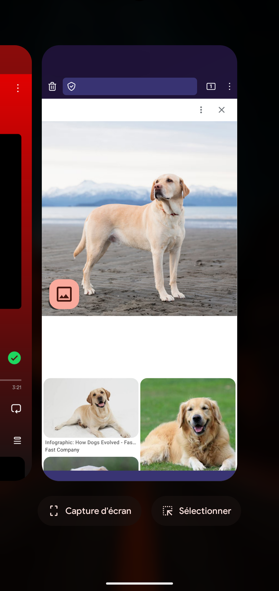
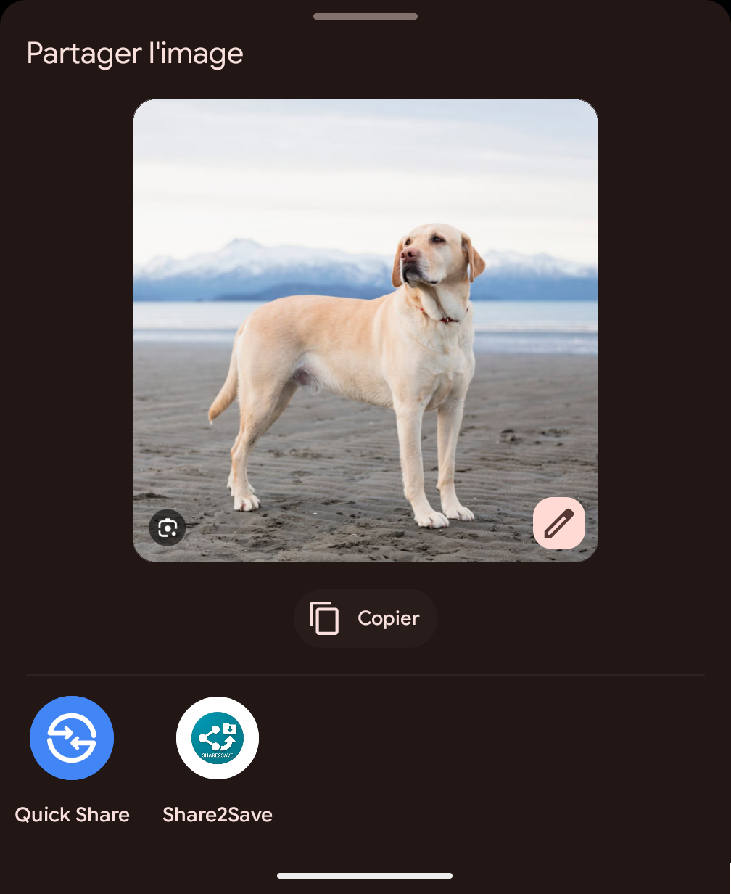
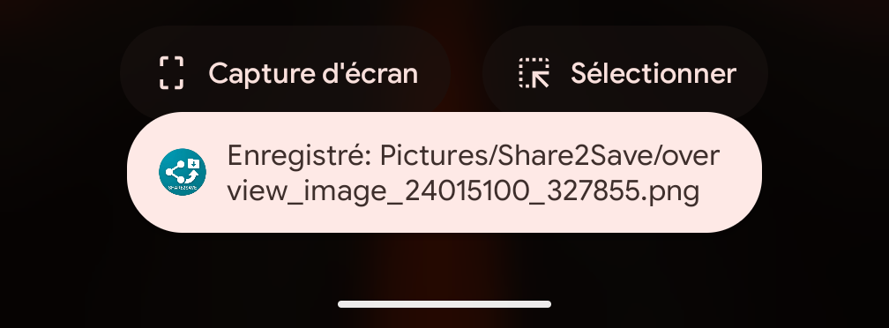

Share2Save
=========

Share2Save is a small vibe-coded Android utility that receives shared content (images, videos, audio, or generic files) from other apps and saves it to the user's Pictures folder using MediaStore when possible. A short Toast notification confirms each successful save.

### Context
I built Share2Save as a direct response to the March 2026 Pixel update (Android 16 QPR3), which frustratingly removed the "Save to Photos" shortcut from the Recent Apps screen. While Google kept the options to copy, edit or share, the removal of a direct save button turned a one-tap workflow into a multi-step chore involving manual file management. This app restores that lost efficiency; by acting as a share target that handles the MediaStore logic silently in the background, it allows you to "Share to Save" and instantly archive media without ever leaving your current context or surfacing a cumbersome UI

### Usage
| 1. Open Recent Apps | 2. Select Share2Save | 3. Confirmed Save |
| :---: | :---: | :---: |
|  |  |  |

Use case
- Save files (photos, videos, or other shared content) from the Android share menu directly into a dedicated folder (Pictures/Share2Save). Useful for quickly archiving media or attachments without opening a full gallery or downloads manager.

Getting started
- Open the project in Android Studio.
- Build and install on a connected device or emulator.
- From any app, choose Share → Share2Save to save the shared content.

- Build the debug APK (Windows PowerShell):

```powershell
.\gradlew.bat assembleDebug
```

Prerequisites
- Java / JDK 17 and `JAVA_HOME` configured.
- Create `local.properties` at the project root (copy `local.properties.template`) and set `sdk.dir` to your Android SDK path.
- Ensure the Gradle wrapper JAR is present or install Gradle on your system.

Notes
- On Android Q (API 29) and above the app uses MediaStore with a RELATIVE_PATH inside `Pictures/Share2Save`.
- On older Android versions, files are written to `Environment.DIRECTORY_PICTURES` directly.
- This project is intentionally minimal and focused on a single responsibility: saving shared content.